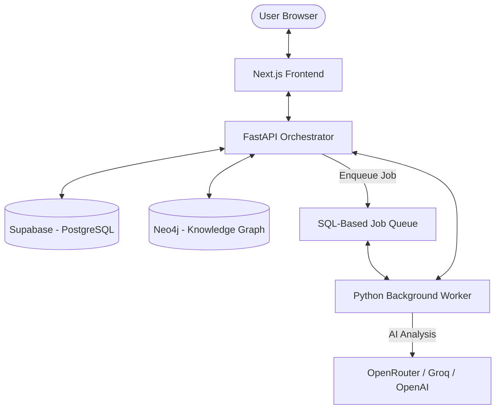

# DiggerAI - Technical Architecture (v3.2)

## 1. High-Level System Overview
DiggerAI is a distributed system designed for scale and resilience. It follows a decoupled architecture where the user interface, the API orchestration layer, and the long-running analysis engines are separated.

## 2. Core Components

### 2.1. Frontend (Next.js 14)
*   **Role:** User interface for solution management, interactive graph exploration, and chat.
*   **Visual Engine:** Uses **React Flow** for hierarchical graph rendering and **Dagre** for automated layout.
*   **Perspectives:** Implements client-side filtering to switch between "Architect" and "Engineer" personas without re-fetching data.

### 2.2. API Orchestrator (FastAPI)
*   **Role:** Main entry point for all operations. Handles authentication, solution metadata, and job scheduling.
*   **Services:**
    *   `CatalogService`: Manages transactional data in Supabase (Assets, Edges, Evidence).
    *   `GraphService`: Handles projections to Neo4j and data transformation for React Flow.
    *   `ReportService`: Generates professional PDF summaries using `fpdf2`.
    *   `PlannerService`: Inventories files and calculates cost/time estimates.

### 2.3. Background Worker (Pipeline Engine)
*   **Role:** Processes the "heavy lifting" (unzipping, parsing, LLM calls).
*   **The Orchestrator Stage:** Executes a 5-step pipeline:
    1.  **Ingest:** Receives ZIP/Git and stores in `temp_uploads`.
    2.  **Plan:** (Fast) Classifies files and builds the `job_plan`.
    3.  **Execute (Extract):** The core analysis stage. Iterates through the approved plan.
    4.  **Persist:** Saves findings to Supabase (primary) and Neo4j (projection).
    5.  **Audit:** Logs every action and token usage for cost tracking.

### 2.4. ActionRunner (AI Execution Layer)
*   **Role:** A resilient wrapper for LLM interactions.
*   **Capabilities:** 
    *   **Retry Logic:** Handles rate limits and transient errors.
    *   **Fallback chain:** If a large model fails (e.g., DeepSeek-V3), it can fallback to a faster one (e.g., Llama-3-8B).
    *   **JSON Validation:** Ensures AI responses strictly follow the required technical schemas.

## 3. Data Strategy

### 3.1. Supabase (The Source of Truth)
*   Used for all transactional and relational data. 
*   **Hierarchy:** Captured via the `parent_asset_id` column, allowing for 1:N folder/package relationships.
*   **Evidence:** snippets of source code linked to every discovered asset to ensure auditability.

### 3.2. Neo4j (The Visual Projection)
*   Used purely for graph-based traversal and visualization.
*   Data is synchronized from Supabase after each extraction to ensure the graph view is up-to-date.

## 4. Interaction Flow: "Who calls Whom"

1.  **User Uploads ZIP:** `Web` -> `API (/solutions)`. API creates record and stores file.
2.  **Trigger Analysis:** `Web` -> `API (/jobs)`. API enqueues a job ID.
3.  **Worker Picks Up:** `Worker` sees job in `Queue`. It starts the `PipelineOrchestrator`.
4.  **Planning Phase:** `Worker` runs `PlannerService`, populates `job_plan_item` table. Solution status = `READY_TO_APPROVE`.
5.  **User Approves:** `Web` -> `API (/plans/{id}/approve)`. Enqueues the next execution stage.
6.  **Deep Extraction:** `Worker` runs `SSISDeepExtractor` / `SQLExtractor`. 
    - Parser-only extraction for structure.
    - `ActionRunner` for logic enrichment.
7.  **Graph Update:** `Worker` calls `GraphService.sync_projection()`.
8.  **Completion:** `Worker` updates `solution.status = READY`. `Web` polls and refreshes.

---
*Generated by DiggerAI Technical Documentation Engine v3.2*
